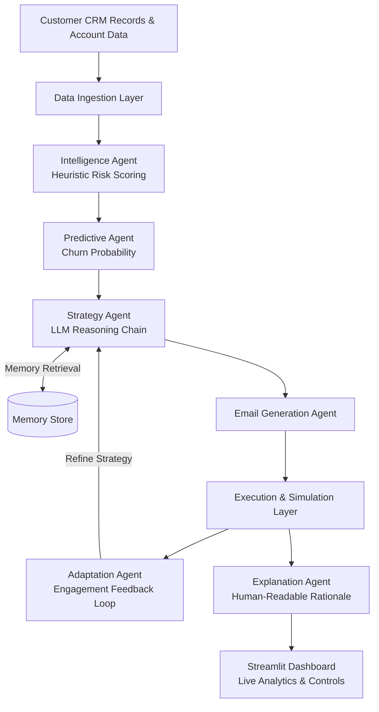
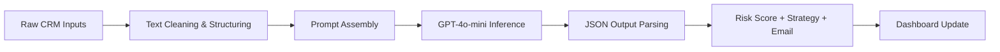

# RevPilot AI — Autonomous Revenue Intelligence System

[](https://www.python.org/)
[](https://streamlit.io/)
[](https://openai.com/)
[](LICENSE)

> **RevPilot AI** is a multi-agent autonomous revenue intelligence platform that continuously monitors customer accounts, predicts churn risk, synthesizes retention strategies, and executes personalized outreach — all without human intervention.

---

## 📖 Project Overview

Modern businesses struggle to act on the thousands of customer signals generated daily — support tickets, email opens, deal inactivity, and engagement drops. By the time a human analyst identifies a disgruntled client, the opportunity is often already lost.

**RevPilot AI** solves this by deploying a chain of specialized AI agents that:
- Ingest and evaluate CRM account signals in real time
- Score churn risk using a hybrid heuristic + LLM model
- Auto-generate personalized retention emails
- Adapt outreach strategies based on simulated engagement feedback
- Present live business intelligence through an interactive dashboard

---

## ✨ Features

| Feature | Description |
|---|---|
| 🔍 **Risk Classification** | Tiered HIGH / MEDIUM / LOW scoring using a deterministic heuristic model |
| 🤖 **Churn Prediction** | Probabilistic churn rate extrapolation per account |
| 🧠 **LLM Strategy Engine** | GPT-powered context-aware retention strategy generation |
| ✉️ **Automated Email Drafting** | Personalized, empathetic recovery emails per deal |
| 🔄 **Adaptation Agent** | Iterates subject lines and messaging based on simulated engagement signals |
| 📊 **Live Dashboard** | Real-time metrics — Revenue Impact, Recovered Deals, Conversion Rate, Risk Distribution |
| 🧩 **Autonomous Mode** | One-click toggle to run the full pipeline end-to-end without human input |
| 🗂️ **Execution Tracing** | Timestamped agent trace logs for full decision auditability |

---

## 🏗️ System Architecture



---

## 📸 Application Screenshots

### Dashboard Overview


### Intelligence Insights


### Pipeline Overview


### System Control


---

## 🛠️ Technology Stack

| Layer | Technology |
|---|---|
| **Language** | Python 3.10+ |
| **Frontend / UI** | Streamlit |
| **LLM Provider** | OpenAI GPT-4o-mini |
| **Agent Orchestration** | Custom multi-agent pipeline (`agents.py`) |
| **CRM Simulation** | In-memory mock CRM with dynamic deal generation (`crm.py`) |
| **Analytics** | Streamlit native charts |
| **Configuration** | `requirements.txt`, environment variables |

---

## 📁 Project Structure

```
revpilot_ai/
├── app.py               # Streamlit UI — dashboard, controls, visualizations
├── agents.py            # All AI agents: intelligence, strategy, email, adaptation, explanation
├── llm.py               # OpenAI API wrapper and prompt execution
├── crm.py               # Mock CRM: deal generation and account data simulation
├── actions.py           # Execution engine: autonomous cycle orchestration
├── requirements.txt     # Python dependencies
├── dashboard_initial.png
├── intelligence.png
├── pipeline.png
└── system_control.png
```

---

## ⚙️ Installation

```bash
# 1. Clone the repository
git clone https://github.com/Mamidisettivasanthi/revpilot_ai.git
cd revpilot_ai

# 2. Create and activate a virtual environment
python -m venv venv
source venv/bin/activate        # Windows: venv\Scripts\activate

# 3. Install dependencies
pip install -r requirements.txt

# 4. Set your OpenAI API key
export OPENAI_API_KEY="your_openai_api_key_here"
# Windows: set OPENAI_API_KEY=your_openai_api_key_here

# 5. Launch the application
streamlit run app.py
```

---

## 🔄 Workflow



1. **Ingest** — CRM deals are loaded with account metrics (days inactive, engagement score, competitor signals).
2. **Evaluate** — The Intelligence Agent scores each deal; the Predictive Agent estimates churn probability.
3. **Strategize** — The Strategy Agent queries GPT to prescribe a tailored 3-step retention plan.
4. **Execute** — The Email Agent drafts a personalized outreach message; the Adaptation Agent refines based on feedback.
5. **Explain** — The Explanation Agent produces a human-readable rationale for every decision.
6. **Visualize** — All results surface live on the Streamlit dashboard with full trace logs.

---

## 🔮 Future Enhancements

- **Real Email Integration** — Connect to SendGrid / Gmail API for live outbound campaigns
- **Predictive ML Models** — Replace heuristic scoring with trained classification models on historical churn data
- **Multilingual Support** — Process reviews and emails in regional languages
- **Voice Review Transcription** — Integrate OpenAI Whisper for call and voice message analysis
- **CRM Connectors** — Plug-and-play integrations for Salesforce, HubSpot, and Zoho CRM
- **Weekly AI Reports** — Auto-generated executive summaries for customer success teams

---

## 🧑‍💻 Author

**Vasanthi Mamidisetti**  
B.E. Artificial Intelligence & Machine Learning — CBIT, Hyderabad  
[GitHub](https://github.com/Mamidisettivasanthi) · [LinkedIn](https://linkedin.com/in/vasanthi-mamidisetti)

---

*Built as a portfolio-quality demonstration of autonomous multi-agent AI engineering.*
