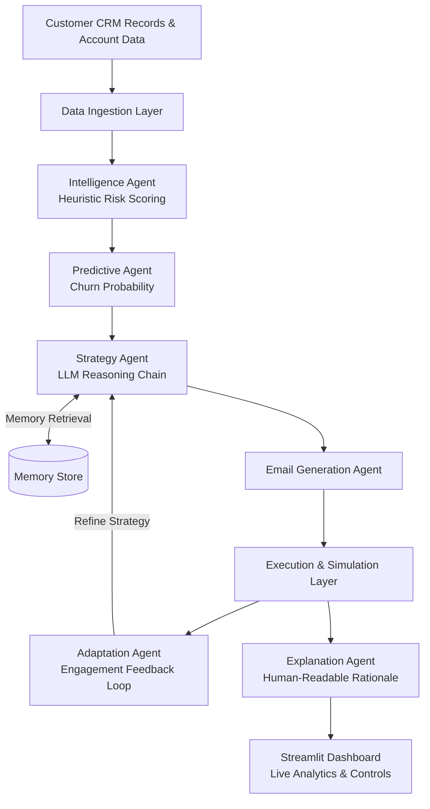
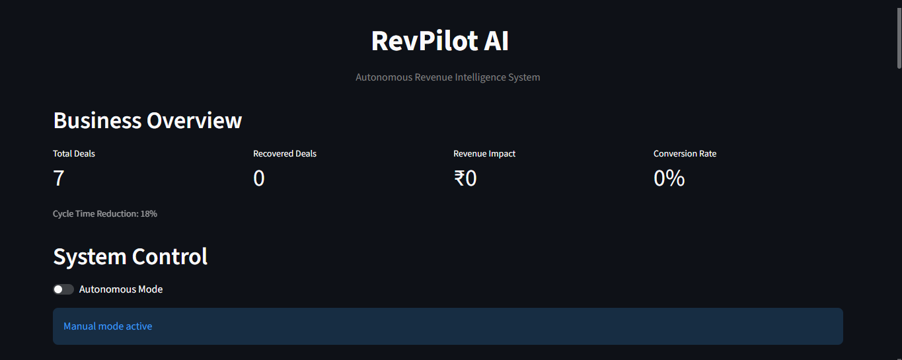
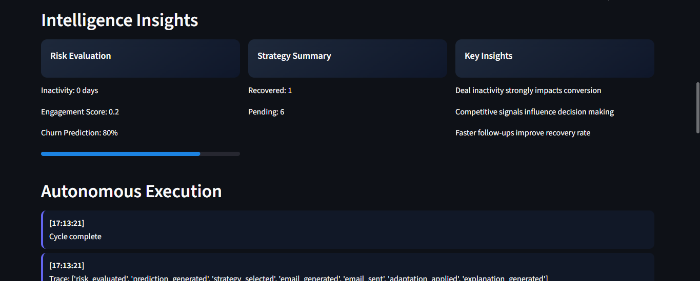
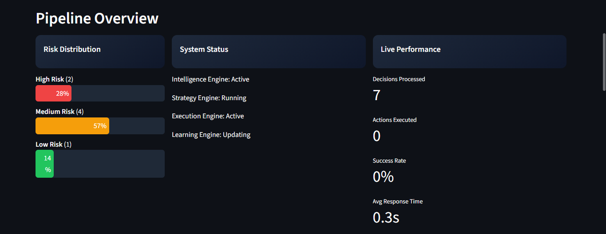
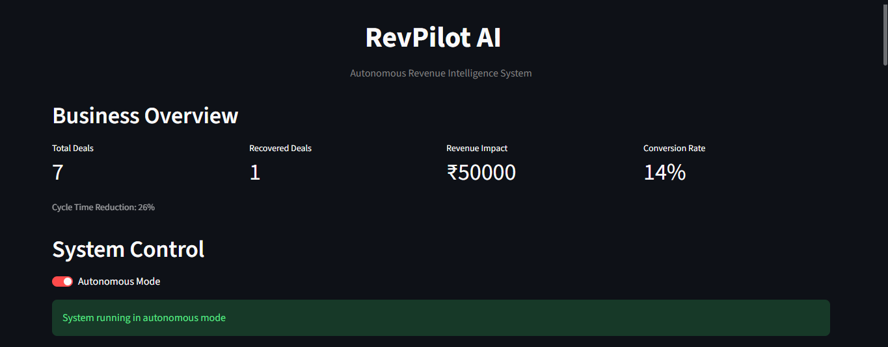
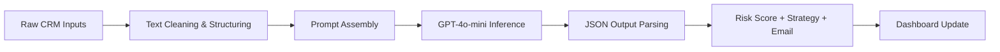

# RevPilot AI — Autonomous Revenue Intelligence System

[](https://www.python.org/)
[](https://streamlit.io/)
[](https://openai.com/)
[](LICENSE)

> **RevPilot AI** is a multi-agent autonomous revenue intelligence platform that continuously monitors customer accounts, predicts churn risk, synthesizes retention strategies, and executes personalized outreach — all without human intervention.

---

## 📖 Project Overview

Modern businesses struggle to act on the thousands of customer signals generated daily — support tickets, email opens, deal inactivity, and engagement drops. By the time a human analyst identifies a disgruntled client, the opportunity is often already lost.

**RevPilot AI** solves this by deploying a chain of specialized AI agents that:
- Ingest and evaluate CRM account signals in real time
- Score churn risk using a hybrid heuristic + LLM model
- Auto-generate personalized retention emails
- Adapt outreach strategies based on simulated engagement feedback
- Present live business intelligence through an interactive dashboard

---

## ✨ Features

| Feature | Description |
|---|---|
| 🔍 **Risk Classification** | Tiered HIGH / MEDIUM / LOW scoring using a deterministic heuristic model |
| 🤖 **Churn Prediction** | Probabilistic churn rate extrapolation per account |
| 🧠 **LLM Strategy Engine** | GPT-powered context-aware retention strategy generation |
| ✉️ **Automated Email Drafting** | Personalized, empathetic recovery emails per deal |
| 🔄 **Adaptation Agent** | Iterates subject lines and messaging based on simulated engagement signals |
| 📊 **Live Dashboard** | Real-time metrics — Revenue Impact, Recovered Deals, Conversion Rate, Risk Distribution |
| 🧩 **Autonomous Mode** | One-click toggle to run the full pipeline end-to-end without human input |
| 🗂️ **Execution Tracing** | Timestamped agent trace logs for full decision auditability |

---

## 🏗️ System Architecture



---

## 📸 Visual Walkthrough — How to Use RevPilot AI

This section walks you through every screen of the application so you know exactly what you're looking at when you run it for the first time.

---

### Step 1 — Dashboard Overview (Manual Mode)



When you first launch the app with `streamlit run app.py`, this is the screen you'll see.

| Element | What it means |
|---|---|
| **Total Deals** | Number of customer accounts loaded from the mock CRM. Here, 7 deals are active. |
| **Recovered Deals** | Accounts successfully re-engaged by the system. Starts at 0 — no actions run yet. |
| **Revenue Impact** | Total revenue recovered across all deals. ₹0 until the pipeline executes. |
| **Conversion Rate** | Percentage of at-risk deals successfully recovered. 0% at startup. |
| **Cycle Time Reduction** | How much faster the AI resolves deals compared to a manual baseline (18% shown). |
| **Autonomous Mode toggle** | Currently OFF (grey). The system is in **Manual Mode** — no agents are running. |
| **"Manual mode active" banner** | Blue banner confirms no autonomous actions are being taken yet. |

> 💡 **What to do here:** This is your starting state. You can review the deal metrics and then scroll down or flip the toggle to activate autonomous execution.

---

### Step 2 — Intelligence Insights Panel



After the pipeline runs one cycle, the **Intelligence Insights** section populates with three cards and the execution log below.

**Risk Evaluation card (left)**
| Field | What it means |
|---|---|
| **Inactivity** | Days since the client last responded. 0 days = recently active. |
| **Engagement Score** | A 0–1 score reflecting how actively the client interacts. 0.2 = low engagement. |
| **Churn Prediction** | Probability the client will leave. 80% = high churn risk. The blue progress bar visualises this. |

**Strategy Summary card (centre)**
| Field | What it means |
|---|---|
| **Recovered: 1** | One deal has been successfully recovered in this cycle. |
| **Pending: 6** | Six deals are still in progress or awaiting action. |

**Key Insights card (right)**  
These are AI-generated observations from the Strategy Agent — not hard-coded. They change per cycle based on what patterns the LLM detects across all deals. Examples shown:
- *"Deal inactivity strongly impacts conversion"* — the agent noticed that dormant deals are the biggest risk factor.
- *"Competitive signals influence decision making"* — competitor mentions in deal notes are flagging as churn triggers.
- *"Faster follow-ups improve recovery rate"* — the adaptation loop found that early outreach yields better results.

**Autonomous Execution Log (bottom)**  
Timestamped trace entries show exactly which agents ran and in what order:
```
[17:13:21] Cycle complete
[17:13:21] Trace: ['risk_evaluated', 'prediction_generated', 'strategy_selected',
           'email_generated', 'email_sent', 'adaptation_applied', 'explanation_generated']
```
This means all 7 agents fired successfully in sequence for this deal.

> 💡 **What to do here:** Read the Key Insights to understand what the AI found. Check the trace log to verify all agents executed without errors.

---

### Step 3 — Pipeline Overview



This section gives you a bird's-eye view of the entire deal pipeline and system health.

**Risk Distribution card (left)**
| Tier | Count | Bar |
|---|---|---|
| **High Risk** | 2 deals | Red bar — 28% of pipeline |
| **Medium Risk** | 4 deals | Orange bar — 57% of pipeline |
| **Low Risk** | 1 deal | Green bar — 14% of pipeline |

This tells you at a glance where the most critical accounts are concentrated. A pipeline dominated by red/orange bars means immediate action is needed.

**System Status card (centre)**  
Shows the live state of each internal engine:
| Engine | Status | What it does |
|---|---|---|
| **Intelligence Engine** | Active | Scoring risk for all deals |
| **Strategy Engine** | Running | Generating retention strategies via GPT |
| **Execution Engine** | Active | Sending simulated outreach emails |
| **Learning Engine** | Updating | Storing outcomes in memory for future cycles |

**Live Performance card (right)**
| Metric | Value | What it means |
|---|---|---|
| **Decisions Processed** | 7 | All 7 deals have been evaluated |
| **Actions Executed** | 0 | No recovery emails sent yet (manual mode) |
| **Success Rate** | 0% | No recoveries confirmed yet |
| **Avg Response Time** | 0.3s | Time per agent decision — fast inference |

> 💡 **What to do here:** Monitor the Risk Distribution to prioritise which deals need attention. Watch Actions Executed increase as the system runs more cycles.

---

### Step 4 — System Control (Autonomous Mode ON)



This is the same dashboard after enabling **Autonomous Mode**.

| Change from Step 1 | What happened |
|---|---|
| **Toggle is now red/ON** | Autonomous Mode is active — agents are running continuously. |
| **"System running in autonomous mode" banner** | Green banner confirms the full pipeline is live. |
| **Recovered Deals: 1 → shown** | One account has been successfully recovered. |
| **Revenue Impact: ₹50,000** | That recovered deal had ₹50,000 in deal value. |
| **Conversion Rate: 14%** | 1 out of 7 deals (≈14%) recovered. |
| **Cycle Time Reduction: 26%** | With one full cycle complete, the system has reduced resolution time by 26%. |

> 💡 **What to do here:** Flip the Autonomous Mode toggle to ON and watch the metrics update live. Each cycle processes all deals, fires all agents, and refreshes the dashboard. Leave it running for multiple cycles to see Recovered Deals and Revenue Impact grow.

---

## 🛠️ Technology Stack

| Layer | Technology |
|---|---|
| **Language** | Python 3.10+ |
| **Frontend / UI** | Streamlit |
| **LLM Provider** | OpenAI GPT-4o-mini |
| **Agent Orchestration** | Custom multi-agent pipeline (`agents.py`) |
| **CRM Simulation** | In-memory mock CRM with dynamic deal generation (`crm.py`) |
| **Analytics** | Streamlit native charts |
| **Configuration** | `requirements.txt`, environment variables |

---

## 📁 Project Structure

```
revpilot_ai/
├── app.py               # Streamlit UI — dashboard, controls, visualizations
├── agents.py            # All AI agents: intelligence, strategy, email, adaptation, explanation
├── llm.py               # OpenAI API wrapper and prompt execution
├── crm.py               # Mock CRM: deal generation and account data simulation
├── actions.py           # Execution engine: autonomous cycle orchestration
├── requirements.txt     # Python dependencies
├── dashboard_initial.png
├── intelligence.png
├── pipeline.png
└── system_control.png
```

---

## ⚙️ Installation

```bash
# 1. Clone the repository
git clone https://github.com/Mamidisettivasanthi/revpilot_ai.git
cd revpilot_ai

# 2. Create and activate a virtual environment
python -m venv venv
source venv/bin/activate        # Windows: venv\Scripts\activate

# 3. Install dependencies
pip install -r requirements.txt

# 4. Set your OpenAI API key
export OPENAI_API_KEY="your_openai_api_key_here"
# Windows: set OPENAI_API_KEY=your_openai_api_key_here

# 5. Launch the application
streamlit run app.py
```

---

## 🔄 Workflow



1. **Ingest** — CRM deals are loaded with account metrics (days inactive, engagement score, competitor signals).
2. **Evaluate** — The Intelligence Agent scores each deal; the Predictive Agent estimates churn probability.
3. **Strategize** — The Strategy Agent queries GPT to prescribe a tailored 3-step retention plan.
4. **Execute** — The Email Agent drafts a personalized outreach message; the Adaptation Agent refines based on feedback.
5. **Explain** — The Explanation Agent produces a human-readable rationale for every decision.
6. **Visualize** — All results surface live on the Streamlit dashboard with full trace logs.

---

## 🔮 Future Enhancements

- **Real Email Integration** — Connect to SendGrid / Gmail API for live outbound campaigns
- **Predictive ML Models** — Replace heuristic scoring with trained classification models on historical churn data
- **Multilingual Support** — Process reviews and emails in regional languages
- **Voice Review Transcription** — Integrate OpenAI Whisper for call and voice message analysis
- **CRM Connectors** — Plug-and-play integrations for Salesforce, HubSpot, and Zoho CRM
- **Weekly AI Reports** — Auto-generated executive summaries for customer success teams

---

## 🧑‍💻 Author

**Vasanthi Mamidisetti**  
B.E. Artificial Intelligence & Machine Learning — CBIT, Hyderabad  
[GitHub](https://github.com/Mamidisettivasanthi) · [LinkedIn](https://linkedin.com/in/vasanthi-mamidisetti)

---

*Built as a portfolio-quality demonstration of autonomous multi-agent AI engineering.*
